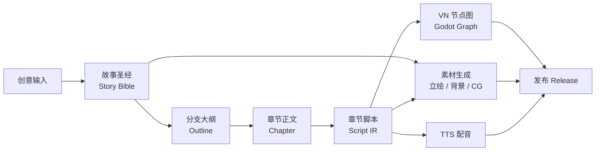

<div align="center">

# if_line

**AI 视觉小说生成平台 —— 从一句创意到可玩的视觉小说**

[](https://www.python.org/)
[](https://fastapi.tiangolo.com/)
[](https://vuejs.org/)
[](https://docs.celeryq.dev/)
[](https://www.postgresql.org/)

[特性](#特性) · [架构](#整体架构) · [快速开始](#快速开始) · [项目结构](#项目结构) · [测试](#测试)

</div>

---

## if_line 是什么

if_line 把"写一部视觉小说"拆成一条由 LLM 驱动的流水线：输入一个创意，平台自动生成故事圣经、分支大纲、章节正文、章节脚本（对白 / 场景 / 演出标注），编译成 **Godot 兼容的 VN 节点图**，并配套生成素材（角色立绘 / 背景 / 关键帧 CG）与 TTS 配音。所有环节都提供 Web 编辑器供人工审阅、修改与发布，最终产出一个可在浏览器预览、在 Godot 播放器中游玩的完整作品。

## 特性

- **五阶段创作管线** — 故事圣经 → 分支大纲 → 章节正文 → 章节脚本 IR → VN 节点图，逐级锚定上游内容哈希，修改任意环节可追溯地触发下游重做
- **不可变修订体系** — 每类产物（bible / outline / chapter / script / graph）均为 append-only 修订 + head 指针，支持分支候选集、发布就绪校验与原子化发布
- **素材生成管线** — 立绘 / 背景 / 关键帧按需生成，视觉风格锁定（style lock）保证全书渲染一致；内置公共素材库与标签分面检索
- **多引擎 TTS** — 阿里云百炼 / MiniMax / 讯飞三引擎，角色级音色池绑定与跨性别音色硬过滤，支持主备引擎兜底
- **Server Agent** — 标准工具调用循环（SSE 流式输出、上下文压缩、SQLite 会话持久化），把正式生成服务暴露为 function tools 由 LLM 自主编排
- **AutoCreator 一键成书** — 选题 → Bible → Outline → 全部章节全自动跑批，内置确定性质量检查 + AI 味评审 + 反馈重写
- **异步任务基建** — Celery 按文本 / 生图分队列部署，任务依赖编排、租约防重、幂等键、用户级配额双轨计费
- **Web 编辑器 + 浏览器播放器** — Vue 3 编辑工作台与 VN 图在线预览播放，公开作品支持免登录游玩

## 整体架构



| 层 | 技术 |
|---|---|
| Web 前端 | Vue 3 · Vite 5 · Pinia · Element Plus |
| API | FastAPI · Pydantic v2 · OpenAPI 3（`backend/openapi.v2.json`） |
| 编排 / 异步 | Celery worker + beat · Redis broker · 分队列（text / image） |
| 数据 | PostgreSQL 16（开发可退化为 SQLite）· SQLAlchemy 2 · Alembic 迁移 |
| LLM / 生图 / TTS | OpenAI 兼容文本 API · Qwen-Image 兼容图像 API · 阿里云 / MiniMax / 讯飞语音 |
| Agent | 工具调用循环 + SSE 流式 + 会话持久化 + trace |

## 快速开始

### 环境要求

- Python 3.12+、Node.js 18+
- Redis（异步生成任务必需）
- PostgreSQL 16（可选——开发环境默认 SQLite，开箱即用）

### 1. 启动后端

```bash
cd backend

# 创建虚拟环境（conda 或 venv 均可）
conda create -p venv python=3.12 -y
# python3.12 -m venv venv

./venv/bin/pip install -r requirements.txt

# 配置环境变量：填入 LLM（必需）、生图 / TTS（可选）密钥
cp .env.example .env

# 数据库迁移（默认 SQLite；PostgreSQL 改 DATABASE_URL 即可）
./venv/bin/python -m alembic -c alembic.ini upgrade head

# 一键启动三件套：API(60002) + Celery worker + beat
./dev.sh start
```

启动后：

- API 文档（Swagger）：<http://127.0.0.1:60002/docs>
- 日志：仓库根目录 `logs/{uvicorn,celery-worker,celery-beat}.log`

`dev.sh` 常用命令：

| 命令 | 作用 |
|---|---|
| `./dev.sh start` | 后台启动三件套（幂等，已在跑的自动跳过） |
| `./dev.sh stop` | 停止三件套 |
| `./dev.sh restart` | 重启 |
| `./dev.sh status` | 进程 / 端口 / 日志尾部总览 |
| `./dev.sh logs api\|worker\|beat` | 跟踪对应服务日志 |

### 2. 启动前端

```bash
cd frontend
npm install
npm run dev
```

访问 <http://localhost:5173>（Vite 已把 `/api`、`/static` 代理到后端 60002）。注册账号即可开始创建项目。

### 3. 最小可用配置

只跑通"文本创作链"（Bible → 大纲 → 章节）时，`.env` 里仅需填写 LLM 三项；素材与配音按需开启：

```ini
OPENAI_API_KEY=sk-xxx          # 任意 OpenAI 兼容服务
OPENAI_BASE_URL=https://api.deepseek.com
LLM_MODEL=deepseek-v4-flash
IMAGE_GENERATION_ENABLED=false # 不配生图密钥时关闭
TTS_ENABLED=false
```

## 项目结构

```
if_line/
├── backend/
│   ├── app/
│   │   ├── routers/v2/        # API v2：authoring_* 创作链 + 素材/阅读/发布
│   │   ├── application/       # 任务编排：五阶段生成服务、修订/发布/资源服务
│   │   ├── services/          # 领域逻辑：Script IR、VN 图编译器、提示词模板、
│   │   │                      #   立绘/背景/关键帧管线、TTS、公共素材库
│   │   ├── integrations/llm/  # LLM 适配器（章节脚本切分+标注契约等）
│   │   ├── agent/             # Server Agent 工具循环、AutoCreator、AI 味评审
│   │   ├── workers/           # Celery 任务
│   │   └── models_v2.py       # 修订/路径/发布等核心表模型
│   ├── alembic/               # 数据库迁移链
│   ├── tests/                 # pytest 测试套件
│   ├── openapi.v2.json        # API 契约快照
│   └── dev.sh                 # 后端三件套一键管理
├── frontend/
│   └── src/
│       ├── views/             # 工作台(WorkflowView)、项目列表、VN 播放器等
│       ├── api/               # 类型化 API 客户端（与 openapi.v2.json 对齐）
│       └── composables/       # 组合式逻辑
├── static/assets/             # 素材库（立绘 / 背景 / 关键帧）
└── Docs/                      # 设计文档与阶段蓝图
```

## 测试

```bash
# 后端（与 CI 同款命令）
cd backend && venv/bin/python -m pytest -m "not integration and not regression_pending" -q

# 前端单元测试 / E2E
cd frontend && npm run test:unit
cd frontend && npm run test:e2e
```

## 文档

- API 契约：`backend/openapi.v2.json`（由 `backend/venv` 生成，可直接导入 Apifox / Swagger）
- Agent 体系：`backend/app/agent/README.md`、`backend/app/agent/SERVER_AGENT_API.md`
- 设计文档与阶段蓝图：`Docs/`
- 生图配置说明：`backend/IMAGE_GENERATION_SETUP.md`

## 参与贡献

欢迎 Issue 与 PR。提交前请确保后端测试套件与前端 `type-check` 通过；涉及接口变更时需同步更新 `openapi.v2.json` 并在提交说明中标注 `API-CHANGE`（破坏性标 `BREAKING`）。
