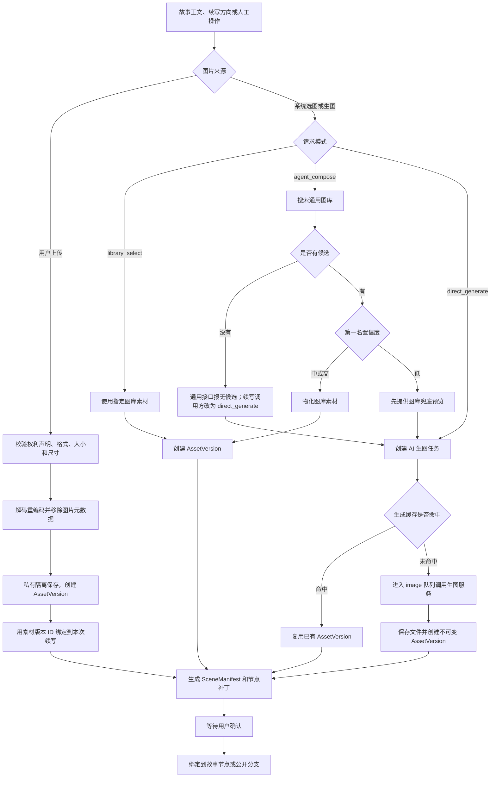
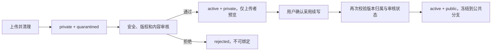

# 全故事通用图库：AI 选图与用户上传说明书

> 适用范围：`if_line` 中的全部故事、项目和视觉小说节点  
> 文档版本：2026-07-20
> 依据：当前线上后端代码  
> 重点：AI 如何从通用图库选图，以及用户自己上传图片后系统如何处理  
> 本文说明当前已实现的逻辑；“建议补齐”的内容会单独标注，不把规划当成现状
>
> 2026-08-02 更新：本文关于图库检索和用户上传的部分仍有效；作者侧 `direct_generate`、Agent 低匹配自动生图及 LegacyImageRenderer 描述均为历史实现。项目章节 AI 生图只允许走 [Chapter Script 资源任务链路](./image-generation-function-flow.md)。

## 1. 核心结论

图库是全故事共用的，不按单个故事拆成独立图库。

系统通过以下字段判断一张素材是否适合当前故事和场景：

- `asset_type`：背景、人物立绘或关键画面；
- `style`：历史、仙侠、现代等视觉风格；
- `taxonomy`：地点、时间、天气、表情、姿势等结构化属性；
- `identity_group`：人物身份；
- 描述、标签和语义相似度；
- 素材质量分。

当前系统的生图原则是：

1. 先读正文，拆出真正发生视觉变化的“视觉时刻”，不能只按地点选图；
2. AI 选图库时先做硬过滤，再对剩余候选评分排序；
3. 能复用图库时优先复用；
4. 图库没有合适素材，或者匹配置信度过低时，才创建 AI 生图任务；
5. 同一生成条件已经产生过图片时，直接复用已有版本，不重复计费生成；
6. 用户上传的图片不会进入 AI 的通用图库搜索，而是用明确的素材版本 ID 绑定；
7. AI 新图和用户上传图先成为当前项目或当前阅读会话的素材版本；
8. 玩家确认续写后，冻结的图片版本才会随公共续写分支公开；
9. AI 新图和用户上传图都不会自动进入全局通用图库，进入通用图库需要单独审核和编目。
10. 唯一总准则是“当前这一幕的内容必须匹配；在多个合适候选中，柔性避开近期重复”，不会为了不同而强行换成错误地点、错误人物或错误画风。
11. 所有 AI 生成的 `portrait` 必须通过有效透明像素验收；图库导入的立绘同样拒绝全不透明图片。

### 1.1 一句话区分三条图片来源

| 来源 | 系统怎样得到图片 | 是否调用 AI | 是否自动进入通用图库 |
|---|---|---:|---:|
| 图库选图 | 从已审核的 `LibraryAsset` 中过滤、打分并选第一名 | 否 | 已经在图库中 |
| AI 生图 | 图库低分或无候选时创建后台生成任务 | 是 | 否 |
| 用户上传 | 解码、清理、隔离保存，再用 `AssetVersion` ID 直接绑定 | 否 | 否 |

用户上传不是“把图片传进图库，然后让 AI 再搜索一次”。当前实现是“这次明确使用用户上传的这一张图”。

### 1.2 通用的正文理解规则

所有故事共用同一套判断，不依赖“三国”“校园”或某个固定人物表。

系统先把正文转成结构化视觉时刻。每个视觉时刻至少记录：

- 正文起止位置和证据原句；
- 地点、时间、天气、光线和气氛；
- 当前发生的事件与人物动作；
- 关键物件、环境状态和构图重点；
- 正在说话的人、刚进入画面的人、执行可见动作的人；
- 内容指纹和风格合同版本。

地点相同不等于画面相同。例如“白天的空庭院”“夜里起火的庭院”“雨后众人收拾残局的庭院”是三个不同视觉时刻。相反，如果相邻两段的地点、时间、事件、人物和关键物件都没有实质变化，可以继续使用同一背景，避免毫无意义地跳图。

人物立绘只在下面三类情况出现：

1. 具体命名人物正在说话；
2. 具体命名人物刚进入当前画面；
3. 具体命名人物正在执行正文明确写出的可见动作。

只被提到、回忆、转述，或者出现在书信和物品文字中的人物不出立绘。“众人、士兵、守卫、老人”等泛称也不自动生成个人立绘。正文中首次出现的真实姓名不必预先存在于人物卡，只要能在原文中找到证据，就可以建立稳定人物身份并补齐立绘。

### 1.3 重复控制的当前边界

内容匹配优先于去重，允许同一地点、同一连续事件合理保持同一背景。但需要区分两层逻辑：

1. 通用图库搜索器先按语义、taxonomy、标签、风格和质量算基础分；
2. 调用方可以同时提交最近使用的图库素材 ID 和存储文件 ID，搜索器会在基础分上减去“近期精确重复惩罚”；
3. 最近一幕的重复惩罚最大，越早的使用记录影响越小；最多读取最近 8 条，每个候选的总惩罚封顶为 0.30；
4. 这是柔性降分，不是禁止复用。如果某张图明显最符合当前正文，它仍然可以再次胜出；
5. 当前公共续写会自动从父级公共分支链提取最近使用记录；其他故事调用通用搜索器时，也应把自己的最近使用记录传入；
6. 当前还没有在通用评分中比较感知哈希、相似构图或“不同文件但画面几乎相同”的近似重复。

正确目标不是强制最近若干幕完全不同，而是：语义必须先正确，再对过度重复做柔性降分。

### 1.4 四层保护

| 层级 | 保护内容 |
|---|---|
| 正文语义层 | 以地点、时间、事件、动作、关键物件和原文证据建立视觉时刻 |
| 身份与风格层 | 人物身份版本和故事风格合同锁定，表情变化不能把人或画风变掉 |
| 缓存与版本层 | 内容、提示词、风格或身份版本改变时不误命中旧缓存 |
| 重复与质量层 | 通用搜索器已经支持近期图库素材 ID、存储文件 ID 的精确重复柔性惩罚；内容指纹与感知近似图惩罚仍由故事侧处理或等待继续下沉 |

## 2. 关键对象

| 对象 | 作用 |
|---|---|
| `LibraryAsset` | 全故事共用的已审核图库条目 |
| `StorageObject` | 实际图片文件及其可见性、哈希和存储状态 |
| `Asset` | 某个项目中的逻辑素材，例如“本场景背景” |
| `AssetVersion` | 逻辑素材的一次不可变图片版本 |
| `AssetAction` | 一次选库、生图、预览和确认操作 |
| `GenerationTask` | 后台异步生成任务 |
| `SceneManifest` | 本次场景使用了哪些素材版本及其槽位 |
| `VNGraph patch` | 将素材绑定到视觉小说节点的变更 |

`LibraryAsset` 是公共候选；`AssetVersion` 是某次实际使用并可冻结的版本。两者不能混为一谈。

## 3. 完整决策流程



图中的用户上传分支不会经过 `LibraryAsset` 搜索，也不会进入生图缓存。它只复用相同用户、相同项目下已经清理过且 SHA-256 相同的上传文件。

## 4. 视觉请求包含什么

一次完整视觉请求可以包含：

| 字段 | 含义 |
|---|---|
| `asset_type` | `background`、`portrait` 或 `keyframe` |
| `query` / `description` | 用于搜索图库的自然语言描述 |
| `prompt` | 传给生图模型的最终提示词 |
| `style` | 图库风格匹配条件 |
| `taxonomy` | 地点、时代、天气、表情、姿势等属性 |
| `identity_group` | 人物身份硬条件 |
| `target` | 图片最终绑定到哪个来源和节点槽位 |
| `max_assets` | 本次最多选取多少个图库素材 |
| `generate_on_low_confidence` | 图库匹配分低时是否继续生图 |
| `width` / `height` | 生成尺寸，未传时默认 1024×1024 |
| `seed` | 可选的可复现随机种子 |
| `negative_prompt` | 负面提示词 |
| `style_pack_version` | 风格合同版本 |
| `identity_version` | 人物身份合同版本 |
| `prompt_template_version` | 提示词模板版本 |
| `postprocess_version` | 后处理版本 |
| `validator_version` | 质量校验版本 |
| `extra_parameters` | 其他生成配置 |

`target` 会记录素材来源、来源版本、节点键、节点序号和素材槽位，防止图片生成后不知道应该放到哪里。

## 5. 三种处理模式

### 5.1 `library_select`：人工指定图库素材

适用于用户或编辑器已经选定某张图库图片。

处理过程：

1. 校验图库素材存在、已启用且文件有效；
2. 将公共图库文件物化为当前项目的 `AssetVersion`；
3. 创建 `SceneManifest`；
4. 生成节点素材补丁；
5. 进入等待确认状态。

这个模式不调用 AI。

### 5.2 `agent_compose`：先搜索图库，低置信度时升级生图

适用于系统知道“需要什么”，但不知道图库中具体是哪一张。

处理过程：

1. 使用描述、类型、风格、人物身份和 taxonomy 搜索图库；
2. 取排序后的候选，默认最多取 1 张；
3. 如果第一名为中或高置信度，直接使用图库素材；
4. 如果第一名为低置信度：
   - 先把图库第一名作为可立即展示的兜底素材；
   - 如果 `generate_on_low_confidence=true`，同时排队生成更合适的新图；
   - 新图成功后，用新 `AssetVersion` 更新预览；
   - 新图失败时，继续保留原来的图库兜底，不让场景失去图片。

通用 `agent_compose` 接口在硬过滤后完全没有候选时会返回错误。调用方如果希望“无候选就直接生图”，应先搜索一次，并在候选为空时改用 `direct_generate`。当前续写流程就是这样处理背景的。

### 5.3 `direct_generate`：直接 AI 生图

适用于：

- 图库没有满足硬条件的素材；
- 用户明确要求重绘；
- 编辑器明确要求创建新素材；
- 调用方不希望使用图库兜底。

处理过程：

1. 校验提示词不为空；
2. 创建状态为 `generating` 的逻辑 `Asset`；
3. 组装完整 `render_spec`；
4. 计算生成缓存键；
5. 命中缓存则立即复用已有版本；
6. 未命中则创建 `asset.render` 后台任务；
7. 任务进入专用 `image` 队列；
8. 生图服务输出图片后写入私有存储；
9. 创建不可变 `AssetVersion`；
10. 操作进入待确认预览状态。

当 `asset_type=portrait` 时，`direct_generate` 不是“直接透传自由 prompt”。服务会先追加版本化的立绘合同，再由 worker 调用共用生图入口：

- 画面只能有一个孤立角色；
- 半身/全身景别只能保留一种；
- 姿态必须有可信重心、自然肩胯和非对称肢体关系；
- 禁止 T-pose、证件照站姿、角色转面设定表和僵硬手臂；
- 输出必须是透明 RGBA，不能有地面、投影、家具或场景背景；
- `rembg` 后至少 1% 像素近乎全透明、至少 1% 像素为有效前景，否则任务失败。

最终保存和计算 prompt hash 的是这份“实际送入 provider 的受保护 prompt”，因此合同升级不会误复用旧 prompt 的缓存。

## 6. 通用图库怎样搜索

### 6.1 AI 先把正文变成什么

真正“理解正文”的部分发生在图库搜索之前。续写 LLM 或故事侧场景分析器先给出：

- 图片类型：背景、人物立绘或关键画面；
- 对画面的自然语言描述；
- 故事风格；
- 地点、时间、天气、气氛、镜头、表情、姿势等 taxonomy；
- 人物立绘需要的稳定 `identity_group`。

通用搜索器本身不会再次调用大模型阅读整章。它只接收这些结构化条件和描述，再执行确定性的过滤与评分。

中文查询中的一部分常见视觉词会先补成冻结目录使用的英文词，例如“雨夜”补成 `rain night`、“仓库”补成 `warehouse`、“悲伤”补成 `sad`。这是一张代码内置的有限词表，不是通用翻译模型；词表没有覆盖的概念仍主要依赖原始中英文描述、标签和 taxonomy。

### 6.2 先做硬过滤

只有同时满足以下条件的素材才会进入候选集：

- `catalog_version` 等于请求的目录版本；
- 素材处于启用状态；
- 素材安全审核状态为 `approved`；
- 存储对象为 `active`；
- 存储对象没有被删除；
- 如果指定 `asset_type`，类型必须完全一致；
- 如果指定 `identity_group`，人物身份必须完全一致；
- taxonomy 中所有非空请求字段必须逐项完全一致。

`identity_group` 和 taxonomy 是硬条件。条件写得过细时，可能得到零候选。

`style` 不在这一阶段过滤，因此画风不一致的素材仍可能进入候选集，只是在后续评分中失去风格分。

### 6.3 再做评分排序

通过硬过滤后，先使用以下公式计算基础分：

| 分项 | 权重 |
|---|---:|
| 描述的语义向量相似度 | 45% |
| taxonomy 和标签的词语重合度 | 35% |
| 风格完全一致 | 10% |
| 素材质量分 | 10% |

然后计算：

```text
最终分 = max(0, 基础分 - 近期精确重复惩罚)
```

近期记录按“最旧到最新”传入，最多读取最后 8 条。候选如果刚刚使用过，第一次扣 0.14；更早记录按 `0.72` 的比例逐步衰减；同一候选多次出现时会累加，但最多扣 0.30。图库素材 ID 与存储文件 ID 两项取较大的惩罚，避免同一次重复被重复扣分。

置信度区间：

- `high`：总分不低于 0.78；
- `medium`：总分不低于 0.55；
- `low`：总分低于 0.55。

同分时依次比较 `quality_score` 和 `stable_key`，因此相同正文和相同近期记录会得到稳定结果。

当前语义匹配器是稳定的 `hash-ngram-v1`。它把描述、标签、taxonomy、人物身份、表情、姿势和风格组成文本，再生成 256 维哈希 n-gram 向量。相同输入会产生稳定排序，选图阶段不需要调用外部大模型，也不会因为随机数改变第一名。

需要特别注意：`style` 当前只是 10% 的软评分，不是硬隔离条件。如果某个故事绝对不能混入其他画风，应同时提供明确 taxonomy，或者在调用层建立更严格的风格过滤。

### 6.4 选出第一名后怎样处理

| 结果 | `agent_compose` 的行为 |
|---|---|
| 中、高置信度 | 直接把图库文件物化为当前项目的不可变 `AssetVersion` |
| 低置信度 | 先保留第一名作为兜底；默认同时排队生成升级图 |
| 硬过滤后零候选 | 通用 `agent_compose` 返回 409；续写编排器会改用 `direct_generate` |

`max_assets` 默认是 1。当前自动续写背景取第一名；人物也各取第一名，并避免同一次续写重复绑定同一个人物图库条目。续写还会把父级公共分支链最近使用过的素材传入排序，因此相近候选之间会优先换用未被过度使用的合适图片。

### 6.5 当前评分没有包含什么

当前通用评分已经可以处理“调用方明确传入的近期图库素材 ID 和存储文件 ID”，但仍没有包含：

- 自动读取任意故事全部历史的机制；调用方必须提供近期记录；
- 文件 SHA-256 是否刚用过，因此不同存储对象里的同一图片仍可能被视作两张；
- 感知哈希或图像相似度；
- 同一构图、同一机位的重复惩罚；
- 用户个人偏好；
- 某个故事全部已接受历史；当前续写只读取本分支最近的公共续写链。

所以当前已经把“按正文选图”和“近期精确重复降分”统一到了一个排序步骤，但近似图识别和跨全故事历史统计仍不是这一步的保证。故事侧仍可用内容指纹和画面近似度补充，且不能把这些补充变成强制每幕不同。

### 6.6 一个具体选图例子

假设正文分析得到：

```json
{
  "asset_type": "background",
  "query": "雨夜，人物在城市小巷追逐",
  "style": "noir",
  "taxonomy": {
    "location": "alley",
    "time": "night",
    "weather": "rain"
  }
}
```

系统先删除：

- 所有人物立绘和关键画面；
- 不是当前目录版本的素材；
- 未启用、未审核或文件失效的素材；
- taxonomy 不是 `alley + night + rain` 的背景。

假设剩余候选 A 的四项分数为：

```text
语义相似度 0.86
taxonomy/标签重合度 1.00
风格一致 1.00
质量分 0.82
```

最终分数：

```text
0.45 × 0.86 + 0.35 × 1.00 + 0.10 × 1.00 + 0.10 × 0.82
= 0.919
```

0.919 属于高置信度，所以直接使用候选 A，不调用 AI 生图。

如果第一名只有 0.48，系统会先保留它作为临时兜底，并默认生成一张升级图；如果硬过滤后一个候选都没有，续写编排器会直接创建新背景的 AI 生图任务。

人物立绘也使用同一流程，只是 `identity_group` 是硬条件。例如请求“林夜·悲伤”时，只要传入 `identity_group=linye`，其他人物即使画面更相似也不会进入候选集。

## 7. 用户自己上传图片时的逻辑

### 7.1 上传入口和权限

上传接口：

```text
POST /api/v2/projects/{project_id}/visual-assets/uploads
Content-Type: multipart/form-data
Idempotency-Key: 每次上传请求的唯一键
```

主要字段：

| 字段 | 含义 |
|---|---|
| `file` | 图片文件 |
| `asset_type` | `background`、`portrait` 或 `keyframe` |
| `target_name` | 用户看到的素材名称 |
| `description` | 图片内容描述；当前不会自动识图补标签 |
| `ownership_scope` | `session`、`personal` 或 `project` |
| `reading_session_id` | 会话素材必须提供 |
| `target_json` | 将来要绑定的故事来源、节点和槽位 |
| `rights_attested` | 用户必须确认拥有使用权 |

权限规则：

1. 带 `reading_session_id` 时，当前用户必须拥有该阅读会话，且会话属于目标项目；
2. 不带阅读会话时，当前用户必须是项目所有者；
3. `ownership_scope=session` 时，服务层会再次要求有效的阅读会话；
4. 没有确认图片使用权时直接返回 422；
5. 上传接口受视觉素材功能开关控制。

### 7.2 文件怎样校验和清理

当前上传限制：

- 最大 25 MB，实际值由 `visual_asset_upload_max_bytes` 配置；
- 只支持单帧 PNG、JPEG、WebP；
- 任意一边不能小于 64 像素；
- 任意一边不能大于 8192 像素；
- 总像素不能超过 4000 万；
- 损坏、无法完整解码、动画或多帧图片会被拒绝。

系统不相信文件名和浏览器声明的 MIME 类型，而是实际打开图片并识别格式。比如文件名叫 `fake.jpg`，内容实际是 PNG，最终仍按 PNG 处理。

通过校验后会：

1. 按 EXIF 方向纠正画面；
2. 完整解码后重新编码；
3. 移除 EXIF 等原始隐私元数据；
4. 保留 PNG/WebP 的透明通道，并按真实像素判断是否存在有效透明区；
5. JPEG 如果带透明信息，会铺在白色背景上并转成无透明 JPEG；
6. 记录最终格式、宽高、有效透明状态和 SHA-256。

公共图库编目对 `portrait` 使用相同的有效透明判断。仅仅是 RGBA 模式但所有 alpha 都为 255 的图片会被拒绝，不能依靠 `has_alpha_channel` 冒充透明立绘。

### 7.3 相同图片怎样去重

去重使用“清理并重新编码后的图片 SHA-256”，范围是：

```text
同一用户 + 同一项目 + 相同标准化 SHA-256
```

如果已经存在同一文件，系统复用原 `StorageObject`，不会再保存第二份；接口返回 `reused_storage_object=true`。

此外，`Idempotency-Key` 防止同一请求因网络重试被执行两次：

- 同一用户、同一幂等键、相同请求：返回原结果；
- 同一用户、同一幂等键、不同请求内容：返回 409。

文件去重和请求幂等不是一回事：前者避免重复存图片，后者避免重复创建整次操作。

### 7.4 上传后会创建什么

上传成功会创建：

- 一个当前项目内的逻辑 `Asset`；
- 一个不可变 `AssetVersion`；
- 一个实际文件 `StorageObject`；
- 一个 `mode=upload`、`selection_method=manual_upload` 的 `AssetAction`。

初始状态：

| 对象 | 当前值 |
|---|---|
| `StorageObject.visibility` | `private` |
| `StorageObject.status` | `quarantined` |
| `Asset.status` | `quarantined` |
| `AssetVersion.safety_status` | `pending` |
| `AssetAction.status` | `ready` |
| `AssetAction.stage` | `quarantined` |

权利元数据会记录：

- 来源为用户上传；
- 用户已确认使用权；
- `ownership_scope`；
- 是否有透明通道；
- 原始隐私元数据已移除。

### 7.5 三种 `ownership_scope` 当前分别意味着什么

| 范围 | 当前已实现的约束 | 当前没有自动实现的能力 |
|---|---|---|
| `session` | 必须绑定用户自己的阅读会话 | 不会进入个人图库或全局图库 |
| `personal` | 记录在素材和权利元数据中 | 没有独立的“我的图库”检索、发布或激活流程 |
| `project` | 记录在素材和权利元数据中；无会话上传要求项目所有者 | 不会自动成为项目内可搜索图库条目 |

也就是说，当前 `ownership_scope` 主要是归属记录和会话校验字段，还不是三套完整的图库产品。

### 7.6 用户上传图怎样进入续写

公开阅读器当前使用下面的流程：

1. 用户选择“上传自己的图片”；
2. 前端固定按 `background` 上传，范围为 `session`；
3. 用户勾选“我确认拥有此图的使用权”；
4. 上传接口返回 `asset_version_id`；
5. 创建续写时提交：

```json
{
  "visual_mode": "user_upload",
  "uploaded_asset_version_ids": ["上传得到的 AssetVersion ID"],
  "max_generated_assets": 0
}
```

6. 续写 LLM 仍会生成正文，但不会再为这次续写自动选图库或调用 AI 生图；
7. 后端把指定版本直接写进 `SceneManifest` 和 VN 节点补丁；
8. 续写记录冻结这些版本 ID，刷新页面时不会重新上传或重新选图；
9. 用户确认采用续写后，上传文件被设为 `active + public`，随后所有读者都通过公共续写节点读取同一冻结版本。

`uploaded_asset_version_ids` 最多允许 3 个。当前三国公开阅读器只上传一个背景；通用 schema 允许将来同时绑定多个素材。

### 7.7 用户上传图与 AI 图库的关系

用户上传图不会：

- 自动创建 `LibraryAsset`；
- 自动生成图库 embedding；
- 自动补全标签、taxonomy、风格或人物身份；
- 参与下一次 AI 的通用图库搜索；
- 因为某次续写公开就自动变成全故事可复用素材。

如果希望以后让其他故事也能搜索到这张图，需要经过单独的图库入库流程：审核内容与版权、补全元数据、设定质量分、生成 embedding、写入当前 `catalog_version`，最后启用 `LibraryAsset`。

### 7.8 当前上传链路的已知缺口

下面是当前代码的真实边界，不是规划：

1. 上传结果被标为 `quarantined`，但媒体网关只允许读取 `active` 文件；因此返回的 `media_url` 在隔离阶段不能正常预览；
2. 前端又要求图片成功下载并解码后才展示续写预览，形成“必须预览才能确认，但确认前文件不可读”的状态冲突；
3. 当前没有自动图片安全审核任务把 `safety_status=pending` 改成通过；
4. 确认公开时只检查上传权利声明，没有强制检查 `safety_status`；
5. 提交 `uploaded_asset_version_ids` 时当前主要校验“版本存在且属于同一项目”，还应进一步校验上传者、阅读会话、来源和 ownership scope；
6. `personal` 和 `project` 目前没有配套的可搜索素材管理界面和激活流程。

建议的完整安全流程应是：



在这套补齐前，说明书不能把“隔离预览和审核后公开”描述成已经完整可用。

## 8. 续写时的具体生图逻辑

续写是当前最完整的自动生图入口，但它仍然使用同一套通用图库和生图管线。

### 8.1 先生成正文和场景意图

续写 LLM 根据冻结的以下上下文工作：

- 当前正式发布版本；
- 当前故事节点；
- 当前状态快照；
- 已选公共分支链；
- 用户输入的续写方向。

LLM 返回：

```json
{
  "continuation_text": "续写正文",
  "state_delta": {},
  "scene_intent": {
    "background": "背景描述",
    "style": "风格",
    "taxonomy": {},
    "characters": [
      {
        "name": "人物名",
        "description": "人物外观描述",
        "identity_group": "人物身份组",
        "expression": "表情",
        "pose": "姿势"
      }
    ]
  }
}
```

当前 `scene_intent` 只包含一个主背景意图，人物最多两名。

### 8.2 `max_generated_assets` 的真实含义

- `0`：只生成文字，不创建视觉素材；
- 大于 `0`：先为主背景保留 1 个素材名额；
- 剩余名额最多用于两个人物立绘。

例如上限为 3 时，典型结果是：

- 1 张背景；
- 0 至 2 张人物立绘。

它表示“本次续写最多绑定的素材总数”，不表示“一定调用 AI 生成 3 张图片”。

### 8.3 背景处理

1. 把 `scene_intent.background`、用户输入的续写方向和结构化 taxonomy 合并成背景查询；其中正文生成出的具体场景意图优先，用户方向负责约束故事大方向；
2. 使用 `style` 参与软评分；
3. 使用 `taxonomy` 做硬过滤；
4. 从父级公共续写分支链提取近期图库素材 ID 和存储文件 ID，参与柔性重复降分；
5. 有候选时进入 `agent_compose`：
   - 中高置信度直接使用图库；
   - 低置信度先使用图库兜底，同时排队生图升级；
6. 完全没有候选时进入 `direct_generate`，生图提示词同样包含具体场景、用户方向和 taxonomy，不会只依据通用地点标签；
7. 背景任务完成后与本次续写绑定。

因此续写背景遵循“图库优先、低分升级、无图直生”。

### 8.4 人物处理

当前续写人物不会自动调用 AI 生成人物立绘，而是按以下顺序搜索通用图库：

1. 只处理正文中正在说话、刚入场或执行可见动作的人物；
2. `identity_group` 必须存在，并在每一级检索中始终作为硬条件，确保换表情时仍是同一个人；
3. 先搜索“同一人物 + 精确表情 + 精确姿势”；
4. 没有结果时放宽为“同一人物 + 精确表情”；
5. 仍没有结果时只放宽表情和姿势，搜索同一人物的其他图库变体；
6. 人物描述、表情、姿势和用户续写方向共同组成语义查询，并应用与背景相同的近期重复柔性降分；
7. 同一续写不会重复绑定同一张人物图库素材；
8. 缺少稳定人物身份或同一人物完全没有候选时，跳过该立绘，绝不会取消身份条件后换成另一个人。

所以当前自动续写真正可能新生成的是背景；人物立绘主要从同一身份的一组表情、姿势变体中选择。若要让系统在人物完全无匹配时自动生成人物，需要另行补充人物身份生成和一致性验收链路。

### 8.5 用户主动重绘

续写正文已经生成后，用户可以提交新的场景提示词。

这条路径：

1. 固定生成 `background` 类型；
2. 使用 `direct_generate`；
3. 创建新的背景 `AssetVersion`；
4. 将续写的 `asset_action_id` 指向新操作；
5. 等待图片完成和前端解码；
6. 用户确认后使用新背景。

## 9. AI 生图任务怎样执行

### 9.1 组装 `render_spec`

系统会记录：

```text
prompt
provider
model
prompt_template_version
negative_prompt
negative_prompt_version
seed
width / height
style_pack_version
identity_version
postprocess_version
validator_version
extra_parameters
```

默认值包括：

- 尺寸：1024×1024；
- 风格包：`default-v1`；
- 提示词模板：`visual-action-v1`；
- 后处理：非立绘默认 `none-v1`，立绘为 `portrait-natural-alpha-v2`；
- 校验器：非立绘默认 `visual-qc-v1`，立绘为 `portrait-alpha-v1`。

故事可以在进入通用管线前扩充提示词，并填写自己的风格包和人物身份版本；这不会把图库变成某个故事专属图库。

### 9.2 生成缓存键

缓存键由以下内容共同决定：

- 素材类型、逻辑键、目标名和 taxonomy；
- 来源类型、来源版本和来源内容哈希；
- 提示词哈希；
- 风格包版本；
- 人物身份版本；
- provider 和 model；
- 提示词模板版本；
- seed；
- 宽高；
- 负面提示词哈希及版本；
- 后处理版本；
- 校验器版本；
- 其他生成参数。

以上任一有效生成条件变化，都会产生不同缓存键。

如果同一 `Asset` 已存在相同缓存键的 `AssetVersion`，系统直接复用，不再创建生图任务。

同一新任务也使用缓存键构造幂等键，避免重复请求创建两份后台任务。

### 9.3 后台生成

未命中缓存时：

1. 创建 `asset.render` 任务；
2. 通过持久化任务和 outbox 投递到 `image` 队列；
3. worker 领取任务并释放数据库事务；
4. worker 在事务外调用图片生成服务；
5. 当前兼容 renderer 实际传入：
   - `prompt`；
   - `asset_type`；
   - `width`；
   - `height`；
   - `seed`；
   - 是否跳过 provider 缓存；
6. provider 返回本地图片路径；
7. 若为立绘，底层先保存 provider 原图、执行 `rembg` 并进行像素级透明度验收；
8. worker 校验输出文件仍位于允许的 provider 输出目录；
9. 只接受 PNG、JPEG 或 WebP；
10. 将透明展示图复制到正式存储，并记录 `has_alpha` 与透明度指标；
11. 创建不可变 `AssetVersion`；
12. 完成任务并刷新 `AssetAction`。

身份母版也遵守同一规则，但区分两种用途：`.source.png` 保留 provider 原图用于身份/关键帧参考；公开展示和 VNGraph 使用通过验收的透明 PNG。内部 `is_identity_master` 记录不会出现在公共立绘列表中，避免图库出现重复母版或 VNGraph 优先选到不适合展示的参考图。

### 9.4 当前有效参数与仅记录参数

当前兼容 worker 真正传给图片生成服务的是提示词、素材类型、尺寸、seed 和 provider 缓存开关。

以下字段目前会参与缓存版本和追踪记录，但兼容 worker 没有单独传给 provider：

- `negative_prompt`；
- `style_pack_version`；
- `identity_version`；
- `postprocess_version`；
- `validator_version`；
- `extra_parameters`。

因此当前画风和人物一致性是否真实生效，主要取决于它们是否已经被调用层写进最终 `prompt`，不能只依赖版本字段。

这也是当前生图链路最重要的实现边界：版本字段可以防止不同合同共用同一缓存，但不会自动改变模型输出。

## 10. 结果保存与可见性

### 10.1 普通项目素材

生成结果保存为：

- 一个项目内逻辑 `Asset`；
- 一个不可变 `AssetVersion`；
- 一个带 SHA-256 的 `StorageObject`；
- 一个 `SceneManifest`；
- 一组节点素材补丁。

### 10.2 阅读续写素材

系统生成的阅读续写图片最初是：

- 当前阅读会话范围；
- 私有可见；
- 等待确认。

用户上传图片按当前代码先进入 `private + quarantined`，还没有完成“审核通过后变成 `active + private`”这一步，因此不能把它与系统生成图片的可预览状态混为一谈，详见 7.8。

确认续写后：

1. 冻结 `AssetVersion` ID；
2. 将允许公开的存储对象设为 `active + public`；
3. 保存正文、状态变化、场景清单和节点补丁；
4. 其他用户读取公共分支时得到相同的冻结素材版本。

页面刷新或退出不会要求重新生图，因为故事节点保存的是版本 ID，不是临时内存中的图片。

### 10.3 不会自动进入通用图库

AI 新图和用户上传图进入的是项目素材或阅读分支素材，不会自动创建 `LibraryAsset`。

如果希望所有故事以后都能复用这张图，需要经过独立的图库入库流程：

1. 内容和版权审核；
2. 安全审核；
3. 填写通用描述、标签、taxonomy、style 和质量分；
4. 人物素材填写稳定的 `identity_group`；
5. 设置当前 `catalog_version`；
6. 启用并发布为 `LibraryAsset`。

这样可以避免某个故事的私有角色、错误图或未审核内容污染全局图库。

## 11. 状态和失败处理

### 11.1 主要状态

| 状态或阶段 | 含义 |
|---|---|
| `accepted` | 请求已接受 |
| `generating` | 后台正在生成 |
| `quarantined` | 用户上传文件已隔离，尚未通过审核或激活 |
| `fallback_ready_generating_upgrade` | 已有图库兜底，同时生成升级图 |
| `preview_ready` | 素材已准备好，可预览 |
| `awaiting_confirmation` | 等待用户确认 |
| `ready` | 不需要确认的操作已完成 |
| `applied` | 已应用到正式节点 |
| `failed` | 生成或持久化失败 |
| `cancelled` | 已取消 |

### 11.2 失败行为

| 场景 | 当前行为 |
|---|---|
| 低置信度升级图失败 | 继续使用已准备的图库兜底 |
| 直接生图失败 | `AssetAction` 进入失败状态 |
| 生成任务丢失但有图库兜底 | 保留兜底并报告升级任务缺失 |
| 生成任务丢失且无兜底 | 操作失败 |
| provider 没有返回图片 | 任务标记为可重试失败 |
| provider 输出路径越界 | 拒绝保存 |
| provider 输出格式不支持 | 拒绝保存 |
| 生成完成后数据库持久化失败 | 删除本次新文件，避免孤儿文件 |
| 用户取消 | 请求取消后台任务，操作进入取消状态 |

## 12. 当前实现边界

### 12.1 通用质量校验的当前边界

当前 `LegacyImageRenderer` 会记录 `validator_version`，但没有调用对应的通用图像校验器；返回的 `safety_status` 直接标记为 `passed`，`quality_score` 默认没有实际分数。

所以目前已有的是：

- provider 成功状态检查；
- 输出文件存在性检查；
- 输出目录边界检查；
- 文件格式检查；
- 缓存和版本追踪。

立绘已经在共用 provider 边界统一执行：

- 自然姿态与单人物 prompt 合同；
- `rembg` 原子后处理；
- 有效透明背景像素验收；
- 源图与透明展示图分离；
- worker 将 alpha 指标写入版本元数据。

目前还没有在这条通用 worker 中统一执行：

- 人物身份相似度；
- 画风一致性；
- 水印、文字、畸形肢体等视觉质量检查；
- 背景和关键帧的统一视觉质量后处理。

故事专用预生成服务可能有额外检查，但那些不是当前全故事通用生图 worker 的保证。

### 12.1.1 2026-07-20 透明度审计与修复

本次按真实像素扫描当前数据和缓存：

- 展示目录共有 380 个 PNG 缓存文件，其中 357 个有有效透明区，23 个不透明；
- 23 个不透明文件里只有 2 个唯一文件仍被数据库资产引用，二者都是旧身份母版；
- 修复脚本检查 199 条已完成立绘资产、196 个唯一展示文件，其中 194 个原本合格，2 个已原地修复且保留原始 `.source.png`，修复失败为 0；
- 公共图库当前 202 个启用立绘均通过有效透明检查；
- 三国专用静态库 79 张源立绘、77 张展示缓存，以及项目展示归一化缓存 128 张，均通过同一像素级透明检查；人物 recipe 已升级为 `natural-alpha-canonical-canvas-v4`，旧姿态缓存不再被当作当前生成结果；
- 剩余 21 个不透明 PNG 是未被数据库、图库或 VNGraph 引用的孤立缓存，不影响当前展示。

补充扫描还发现自动化隔离克隆内有 22 个旧不透明副本，`backend/exports/project_6_portraits_white_bg_backup` 有 13 个按名称即用于白底备份的文件。两处都不是运行时静态目录或数据库引用源，不参与图库搜索、API 生图缓存或 VNGraph 展示，因此没有把备份误改成透明展示资产。

当前数据库的 199 条已完成历史立绘都早于 `portrait-natural-alpha-v2`。透明展示文件已修复且仍可读取，但缓存判定会把这 199 条全部视为旧合同；下一次明确生成相应资产时会真正调用新自然姿态 prompt，而不会用旧图伪装成升级结果。三国页面会对当前章节缺失的 v4 人物状态自动调用生成接口，因此 recipe 升级按实际需要渐进重绘，不会一次性生成全部历史变体。

历史数据可用 `python -m app.scripts.repair_portrait_transparency` 只审计；明确加 `--apply` 才会修复。脚本只处理数据库仍引用的已完成立绘，先保留源图，验收通过后才替换展示 PNG。

### 12.2 人物无匹配时不会自动生成

续写人物当前只搜索图库。完全没有候选时会跳过人物，不会进入人物生图任务。

### 12.3 一个续写只有一个主背景意图

当前 LLM schema 只返回一个 `background`。长续写如果需要多场景、多镜头，应把 `scene_intent` 扩展成场景列表，再为每个场景分别选库或生图。

### 12.4 `style` 不是硬过滤

风格只占图库评分的 10%。强风格隔离需要额外的硬过滤或独立 taxonomy 约束。

### 12.5 版本合同不等于模型控制

风格包、人物身份、负面提示词和校验器版本目前可以正确影响缓存失效，但只有最终 prompt 和实际传给 provider 的参数才能直接控制图片结果。

## 13. 建议的通用图库与上传验收清单

- [ ] 任意故事都通过同一个 `LibraryAsset` 目录检索素材；
- [ ] 故事差异由 style、taxonomy、identity 和 prompt 表达；
- [ ] 图库排序能记录并解释硬过滤、各项分数和最终置信度；
- [x] 调用方传入的近期图库素材 ID、存储文件 ID 已在通用排序中做柔性降分；
- [ ] 感知近似图、相同构图和跨全故事历史惩罚继续下沉到通用排序；
- [ ] 中高置信度匹配不会触发无意义生图；
- [ ] 低置信度匹配先有图库兜底，再在后台生成升级图；
- [ ] 零候选时调用方明确切换到 `direct_generate`；
- [ ] 相同来源、提示词和版本合同可以命中生成缓存；
- [ ] prompt 或版本合同变化后不会错误复用旧图；
- [ ] 续写上限 3 不会被误解为生成 3 张 AI 图片；
- [ ] 续写人物没有图库候选时不会伪装成“正在自动生成人物”；
- [ ] 前端等待所有必需图片下载并解码后再展示完整续写舞台；
- [ ] 生图失败但有图库兜底时，兜底仍可使用；
- [ ] 直接生图失败时，界面能显示明确的可重试错误；
- [ ] 未确认的会话图片不会被其他用户读取；
- [ ] 确认后冻结版本，刷新页面不会重新生图；
- [ ] 上传图会被完整解码、重新编码并移除隐私元数据；
- [ ] 隔离上传经过安全审核后才变成 `active + private` 并允许本人预览；
- [ ] 公开前会再次核对审核状态、上传者、阅读会话、来源和使用范围；
- [ ] AI 新图和用户上传图不会未经审核自动污染全局图库；
- [ ] 真正接入质量校验后，校验结果会写入 `quality_score` 和安全状态。

## 14. 主要代码位置

| 模块 | 路径 |
|---|---|
| 通用图库检索、用户上传、AssetAction、续写素材编排 | `backend/app/application/visual_asset_service.py` |
| 图库、上传和续写请求 schema | `backend/app/schemas_visual_asset.py` |
| 图库搜索、上传、续写与确认接口 | `backend/app/routers/v2/visual_assets.py` |
| 文件保存、权限和可见性判断 | `backend/app/application/storage_service.py` |
| 私有与公共媒体读取 | `backend/app/routers/v2/media.py` |
| 生成缓存键、AssetVersion 请求 | `backend/app/application/asset_service.py` |
| 图片后台 worker 和文件持久化 | `backend/app/workers/asset_tasks.py` |
| 实际图片 provider 兼容服务 | `backend/app/services/image_generation_service.py` |
| 续写正文和 `scene_intent` 生成 | `backend/app/integrations/llm/continuation_adapter.py` |
| 续写场景意图 schema | `backend/app/schemas_continuation_generation.py` |
| 前端通用素材上传 API | `frontend/src/api/visualAssetApi.ts` |
| 公开续写上传 API | `frontend/src/api/guestStoryApi.ts` |
| 用户上传、预载和续写确认界面 | `frontend/src/views/ThreeKingdomsPublicView.vue` |
