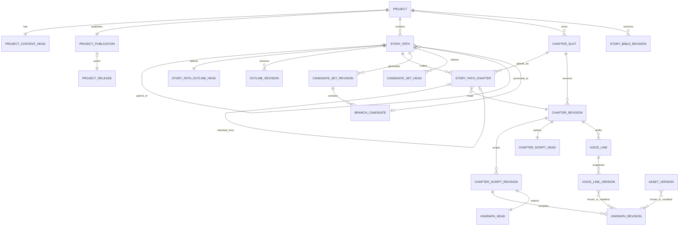

# StoryPath Authoring and Publication Architecture

## 1. Purpose

This document defines the target architecture for branching authoring, revision
review, chapter generation, VNGraph compilation, and public releases. It is the
design authority for Blueprint items R1-R8.

The refactor fixes two identity errors in the legacy system:

1. `chapter_index` acted as display order, logical identity, context selector,
   and artifact join key.
2. project-level heads cannot represent multiple story continuations that share
   a prefix and then diverge.

The target separates four concepts:

- **StoryPath**: an authoring timeline created by an intentional narrative fork.
- **Slot**: the stable logical identity of one chapter on one path lineage.
- **Revision**: an immutable attempt or edit of the same logical artifact.
- **Head**: the author's reviewed selection among revisions.

`display_index` is presentation metadata. It is never accepted as an artifact
identity or used to discover generation context.

## 2. Bounded Contexts and Dependency Direction

```text
Project / Bible
        |
        v
StoryPath / Outline
        |
        v
StoryContextResolver / StoryPathChapter
        |
        v
ChapterRevision -> ChapterScriptRevision -> resource bindings -> VNGraphRevision
        |                                                        |
        +-> CandidateSetRevision -> BranchCandidate -> StoryPath  |
                                                                 v
                                                         ProjectRelease
                                                                 |
                                                                 v
                                                          ReadingSession
```

Dependencies only point downward. Public reading does not query mutable
authoring heads, and authoring does not depend on a ReadingSession. Authoring
StoryPath and reader continuation remain separate domains.

Ownership rules:

| Context | Owns | Must not own |
|---|---|---|
| Project | metadata, Bible Head | public visibility flags |
| StoryPath | path topology, Outline Head | reader progress |
| StoryPathChapter | path ordering, Chapter Head | cross-path chapter lookup |
| CandidateSet | reviewed alternatives at one checkpoint | path creation before selection |
| Script | semantic VNGraph skeleton | mutable asset URLs |
| VNGraph | compiled graph and frozen binding manifest | chapter discovery by index |
| Publication | active immutable Release pointer | authoring Head mutation |
| Reading | session state against one Release | authoring revisions |

## 3. Target Entity Model



### 3.1 StoryPath

| Field | Rule |
|---|---|
| `id` | UUID primary key |
| `project_id` | owning project |
| `parent_path_id` | null only for the root path |
| `fork_path_chapter_id` | parent chapter containing the checkpoint |
| `fork_checkpoint_node_id` | immutable checkpoint identity |
| `fork_candidate_id` | selected candidate that created this path |
| `base_state_snapshot_id` | state after applying the candidate delta |
| `title` | author-facing path name |
| `status` | `active` or `archived` |
| `lock_version` | optimistic concurrency token |

Every project has exactly one root StoryPath. A non-root path must have one
parent, fork chapter, checkpoint, candidate, and base state snapshot belonging
to the same project. Path topology is immutable after creation; title and
status may change.

### 3.2 ChapterSlot and StoryPathChapter

`ChapterSlot` is a stable revision family. It has `id`, `project_id`,
`created_for_story_path_id`, and timestamps. It has no display index.

`StoryPathChapter` places a slot on a path:

| Field | Rule |
|---|---|
| `id` | UUID used by all authoring and public APIs |
| `story_path_id` | owning path |
| `chapter_slot_id` | logical chapter revision family |
| `display_index` | positive integer, unique only inside the path |
| `predecessor_path_chapter_id` | previous chapter on the same path |
| `inherited_from_path_chapter_id` | shared-prefix origin, otherwise null |
| `current_revision_id` | reviewed ChapterRevision, nullable before review |
| `lock_version` | protects Head and ordering updates |

The predecessor chain must be acyclic, remain inside one StoryPath, and match
the path's complete ordering. Reordering changes `display_index` and predecessor
links in one transaction without changing UUIDs.

At a fork, the child path receives new StoryPathChapter rows for the shared
prefix. Those rows reference the same ChapterSlots and reviewed immutable
ChapterRevisions through `inherited_from_path_chapter_id`. The first divergent
chapter receives a new ChapterSlot. Later parent edits never propagate into an
existing child path. Automatic rebase is outside the first release.

### 3.3 Revision and Head Rules

| Artifact | Revision owner | Head owner |
|---|---|---|
| Bible | Project | ProjectContentHead |
| Outline | StoryPath | StoryPathOutlineHead |
| Chapter | ChapterSlot | StoryPathChapter |
| Script | exact ChapterRevision | ChapterScriptHead keyed by ChapterRevision |
| VNGraph | exact ChapterScriptRevision | VNGraphHead keyed by ScriptRevision |
| CandidateSet | StoryPath + checkpoint | CandidateSetHead keyed by path + checkpoint |

Revision payloads and provenance are immutable. A successful generation creates
a `ready` Revision but does not change a Head. A failed generation leaves the
Task failed and does not create a selectable Revision. Activation only updates
the corresponding Head under an `If-Match` lock; it never mutates revision
status to represent selection.

Every Head exists independently from its selected Revision and starts at
`lock_version = 1`. Its `revision_id` is null before the first review selection.
The first selection therefore uses the same compare-and-swap operation as every
later selection; a parent aggregate's lock version is never borrowed as a Head
token. Re-selecting the current Revision with a matching token is a no-op and
does not increment the version. A stale token returns
`409 head.version_conflict` with the current Head envelope.

`parent_revision_id` records editorial ancestry inside one revision family.
It must reference a revision owned by the same family and must not be used to
derive StoryPath ancestry.

### 3.4 Outline

`OutlineRevision` belongs to one StoryPath and references the exact Bible
Revision used to generate it. Its rows reference `story_path_chapter_id` and
store a denormalized `display_index` for frozen presentation.

Activating an Outline performs a reconciliation transaction:

1. Retain existing StoryPathChapter UUIDs explicitly referenced by the draft.
2. Create a new ChapterSlot and StoryPathChapter for each new outline entry.
3. Update ordering and predecessor links.
4. Refuse silent removal of a chapter with revisions; explicit detachment is
   required and the detached data remains addressable to the owner.
5. Do not modify any other StoryPath.

`chapter_count` is a positive request integer with a default configured maximum
of 500. Pace may influence prose instructions but never determines the count.

### 3.5 CandidateSet and BranchCandidate

`CandidateSetRevision` freezes:

- StoryPath and checkpoint identity;
- exact ChapterRevision and StateSnapshot sources;
- generation parameters and source hash;
- ordered candidates and each candidate's `state_delta`.

Different idempotency keys may create multiple sets from the same source.
Source hash is provenance, not global deduplication. `CandidateSetHead` selects
the reviewed set for one `(story_path_id, checkpoint_node_id)` pair.

Candidate queries use the ordered, hashed CandidateSetRevision payload as their
text and state source; mutable preview nodes are not authoritative. Activation
requires that the set's exact ChapterRevision is still selected by the
StoryPathChapter containing the checkpoint. A set whose Chapter Head has moved
remains available in review history but cannot become the active Head. Empty
CandidateSet Heads start at lock version 1, and every selection uses the common
`If-Match` compare-and-swap contract.

Promoting a candidate creates a child StoryPath transactionally. It validates
that the candidate belongs to the active set, copies the shared prefix,
applies `state_delta` into a new StateSnapshot, and records fork provenance.
It never overwrites the parent path or another child.

### 3.6 Script and VNGraph

`ChapterScriptRevision` is the reviewable semantic Script IR and the only
VNGraph skeleton. It belongs to one exact ChapterRevision. Its resource slots
hold explicit AssetVersion bindings.

Script generation resolves the ChapterRevision UUID first and freezes its exact
BibleRevision, OutlineRevision, OutlineChapter, PathChapter provenance, content
hashes, provider input, generation parameters, and the currently selected
Script parent. The worker validates that envelope before any provider call and
again before persistence. `display_index` is frozen presentation metadata; it
never selects a source row and later StoryPath reordering does not redirect the
task.

Each ChapterRevision is an independent Script revision family. Revision numbers
start at one per `chapter_revision_id`, so sibling paths may both have display
chapter 3 and Script revision 1 without collision. Different Idempotency-Keys
create independent review candidates even when their immutable source is the
same. Replaying one key returns only its original task.

Every exact ChapterRevision has a discoverable ChapterScriptHead. It starts
with a null revision and lock version 1. Successful generation creates a
`ready` ChapterScriptRevision but does not move the Head. Selection uses the
common compare-and-swap contract; stale tokens fail with
`head.version_conflict`, and selecting the already-current revision is a
version-preserving no-op.

The old `(project_id, chapter_index)` Script functions and HTTP routes are not
registered after cutover. Script generation, history, Head selection, resource
rendering, and activation all start from an exact ChapterRevision or
ChapterScriptRevision UUID. The retained legacy columns are rollback data, not
an application-service lookup surface.

`VNGraphRevision` belongs to one exact ChapterScriptRevision and freezes a
binding manifest containing every AssetVersion and VoiceLineVersion consumed by
the compiler. Compilation is deterministic for the tuple:

```text
(script_revision_id, binding_manifest_hash, compiler_version, schema_version)
```

The compile command resolves `script_revision_id` first. It never accepts a
ChapterRevision as an alternative skeleton, chooses the latest Script, or
creates a compatibility Script during compilation. Project, ChapterRevision,
and display index values are derived from that exact immutable Script and are
used only for ownership, integrity, and presentation checks.

`VoiceLine` remains an editable TTS work record. At compile enqueue time each
line is converted to, or reuses, a content-addressed `VoiceLineVersion`. The
version stores the complete line payload, its exact audio AssetVersion UUID,
and a content hash. Editing text, speaker, voice profile, audio selection, or
status therefore creates another VoiceLineVersion for a later compile and
cannot redirect an already queued task.

The binding manifest is the only resource payload in a compile task. It stores
the exact Script and Chapter hashes, every selected AssetVersion and storage
object integrity hash, every VoiceLineVersion and audio AssetVersion, and all
compiler policy versions. The worker rebuilds the manifest from its frozen
payload, verifies every referenced immutable database row, and fails closed
before compilation if a row is missing or differs. It never resolves current
resource slots, AssetBindings, or mutable VoiceLines after enqueue.

Successful compilation persists the complete manifest and
`binding_manifest_hash` beside the graph. The database makes the deterministic
compile tuple unique. Asset-action graph children retain the parent manifest,
append exact patch AssetVersions, and record the parent graph and patch hashes.
Legacy graphs receive an explicitly marked legacy manifest during migration;
they are preserved but are never treated as deterministic-v1 compile input.

Each ChapterScriptRevision owns an independent VNGraph revision family and
revision counter. Its VNGraphHead is discoverable before the first compilation,
with a null current revision and lock version 1. Compilation creates a `ready`
VNGraphRevision without moving that Head. Review selection uses compare-and-swap,
including version-preserving no-op re-selection and stale-token rejection.
The selected parent is frozen when a compile task is queued, so a later Head
change cannot redirect editorial ancestry at worker time.

No active service may assemble a graph by `(project_id, chapter_index)`.
The former `VNGraphAssembler` and its Chapter wrapper are removed, including
their implicit reads of legacy VNGraph, Asset, ChapterContent, and voice rows
and their automatic missing-resource generation switch. Resource matching now
happens before compilation through Script resource slots and immutable version
bindings; the compiler only consumes the frozen manifest.

The indexed HTTP compile route and its adapter were removed at R8 cutover.
Compilation is available only at
`POST /chapter-script-revisions/{script_revision_id}/vn-graph-compilations`.

### 3.7 ProjectPublication and ProjectRelease

`ProjectPublication` is the only public-state authority:

| Field | Rule |
|---|---|
| `project_id` | primary key |
| `active_release_id` | nullable FK to a Release of the same project |
| `published_at` | timestamp of current activation, null when unpublished |
| `lock_version` | publication transaction lock |

`Project.visibility`, `Project.is_draft`, `Project.published_at`,
`ProjectContentHead.lifecycle_status`, and
`ProjectContentHead.published_release_id` are legacy migration fields and are
not read or written by target application code.

A Release is immutable after creation. Its manifest freezes the project
metadata, root path, all reachable active paths, path topology, reviewed heads,
state snapshots, resource versions, and entry VNGraph. Public APIs return data
only when the requested Release is the current `active_release_id`.

Publication readiness is a read-only projection over those exact inputs. The
`authoring-fingerprint-v1` calculator canonicalizes publication-relevant project
metadata, the reviewed Bible, every reachable active StoryPath, each path's
reviewed Outline and ordered PathChapter Heads, exact Script and VNGraph Heads,
state snapshots, Script resource slots, and the VNGraph binding-manifest hashes.
It excludes timestamps, lock versions, generation history, unselected
Revisions, and archived paths together with all descendants. A child path must
select its own Outline; an inherited prefix may continue to select the immutable
ChapterRevision frozen when the child was created.

The calculator also verifies immutable payload hashes, path and Outline
topology, exact Revision provenance, current resource-slot and VoiceLine
agreement with the selected VNGraph, and active StorageObjects. Incomplete or
corrupt authoring state is returned as deterministic blocking items rather than
used to build a partial Release. The 64-character authoring fingerprint hashes
both the observed canonical snapshot and its sorted blocking items, so repairing
a blocker invalidates a stale publish precondition even when no reviewed Head
changed.

## 4. State Machines

### 4.1 Authoring artifact

```text
Task queued -> running -> succeeded -> Revision ready -> Head selected
                   |             \
                   +-> failed     +-> Revision remains unselected
```

Head selection is manual for every generated artifact. Retrying generation
creates another Revision in the same family and does not create a StoryPath.

### 4.2 StoryPath

```text
active <-> archived
```

Archiving excludes a path and descendants that become unreachable from future
Release manifests. It does not delete their revisions.

### 4.3 Release

```text
published -> superseded
published -> withdrawn
```

There is no prepared Release. `publish` validates readiness, creates an
immutable published Release, supersedes the previous active Release, and moves
the publication pointer in one transaction. Any failure rolls the transaction
back and leaves no partial Release.

## 5. Generation Context Contract

`StoryContextResolver` is the sole source of chapter-generation context. It
starts from a `path_chapter_id`, follows predecessor links, and resolves every
selected Revision explicitly.

The canonical `context_manifest` contains:

```json
{
  "project_id": 42,
  "story_path_id": "path-uuid",
  "path_chapter_id": "path-chapter-uuid",
  "bible_revision_id": "bible-uuid",
  "bible_content_hash": "sha256",
  "outline_revision_id": "outline-uuid",
  "outline_chapter_hash": "sha256",
  "state_snapshot_id": "state-uuid",
  "state_hash": "sha256",
  "fork": {
    "parent_path_id": "parent-path-uuid",
    "checkpoint_node_id": "node-uuid",
    "candidate_id": "candidate-uuid"
  },
  "fork_choice": {
    "candidate_id": "candidate-uuid",
    "candidate_set_revision_id": "candidate-set-uuid",
    "candidate_set_content_hash": "sha256",
    "fork_path_chapter_id": "path-chapter-uuid",
    "display_index": 5,
    "option_key": "left_gate",
    "preview_text": "The protagonist enters the left gate.",
    "state_delta": {"route": "left"},
    "candidate_content_hash": "sha256"
  },
  "ancestors": [
    {
      "path_chapter_id": "ancestor-uuid",
      "chapter_revision_id": "revision-uuid",
      "display_index": 1,
      "content_hash": "sha256"
    }
  ]
}
```

The payload hashes are computed from the exact Bible JSON, target Outline
chapter, StateSnapshot JSON, and ancestor chapter text consumed by generation.
Frozen resolution recomputes those hashes before returning any payload. For a
child path, `fork_choice.display_index` is resolved from the child-local
placement whose `inherited_from_path_chapter_id` identifies the fork chapter;
later parent-path reordering therefore cannot change the child's fork context.
Readers remain compatible with manifests frozen before these payload fields
were introduced: missing fields fall back to validating the persisted row hash
against its payload, while every newly frozen manifest writes all four hashes.

The context hash is SHA-256 over canonical JSON with sorted object keys and
stable list ordering. Task payloads store the manifest and hash. Workers reject
payloads whose referenced entities do not belong to the declared project and
path. A Head change after task creation does not alter the task's frozen input.
For a child path, chapter generation after the fork also appends the frozen
candidate preview as the final prior-story item. This keeps prose continuity
distinct even when sibling paths share every ChapterRevision before the fork.

## 6. Publication and Draft Truth Table

The owner API derives publication state by comparing the active Release's
authoring fingerprint with the current reviewed-head fingerprint.

| Active Release | Fingerprints equal | Owner state | Public result |
|---|---:|---|---|
| none | n/a | `unpublished` | 404 / absent from catalog |
| published | yes | `published` | active Release is readable |
| published | no | `changes_pending` | previous active Release remains readable |
| withdrawn | n/a | `unpublished` | 404 / absent from catalog |

The author may edit every Head while a Release is active. These edits only
change the owner projection to `changes_pending`; they never mutate public data.

The owner Project response computes two independent projections. It never maps
legacy `Project.status`, `visibility`, `is_draft`, `published_at`, or
`ProjectContentHead.lifecycle_status` into either projection.

| Authoring blocker layer | `authoring.stage` |
|---|---|
| Bible | `bible` |
| root path or path topology | `story_paths` |
| Outline | `outlines` |
| Chapter | `chapters` |
| Script or Script resource slot | `scripts` |
| VNGraph, bound resources, or voice lines | `vn_graphs` |
| no blockers | `ready` |
| unrecognized future blocker | `blocked` |

When several layers are blocked, the earliest layer in this table wins while
`blocking_items` still returns every deterministic readiness blocker. The
running task count includes only project-scoped `queued` and `running` tasks;
`partial` is terminal. `has_unpublished_changes` is false only when an active
Release fingerprint equals the current reviewed authoring fingerprint. It is
true for never-published and withdrawn projects because their current workspace
has no public equivalent.

The publication projection also returns the current ProjectPublication
`lock_version`; a never-published project reports the logical initial value 1.
Clients use this value as `If-Match` for unpublish. Invalid pointers, damaged
manifests, or inconsistent active Release state produce `release.active_invalid`
instead of being projected from legacy fields.

## 7. Transaction Boundaries

The following operations are atomic:

1. Head compare-and-swap under `If-Match`.
2. Outline activation and path chapter reconciliation.
3. Candidate promotion, shared-prefix creation, and StateSnapshot creation.
4. Single-step publish, previous Release supersede, and publication pointer move.
5. Unpublish, active Release withdrawal, and publication pointer clear.

Generation provider calls occur outside database transactions through the
existing Task/Outbox boundary. Finalization transactions verify frozen inputs
before inserting immutable revisions.

The publish service normalizes its Idempotency-Key and request hash, locks (or
creates under the Project lock) the ProjectPublication row, and calculates the
submitted authoring fingerprint. It then locks the mutable Project, Head,
resource-slot, VoiceLine, and StorageObject rows represented by that snapshot
and recalculates readiness. A mismatch at either read returns
`release.source_changed`. The Release insert and ProjectPublication pointer move
run inside one savepoint; callers commit the surrounding request transaction.
When an active Release exists and the reviewed fingerprint changed, the service
creates and flushes the next version, moves the `ProjectPublication` pointer to
that valid `published` Release and flushes, then marks the previous Release
`superseded` and flushes again. Both writes remain in the same savepoint, so a
failure in either phase rolls back the new Release, pointer, lock version, and
previous Release status together. Re-publishing an unchanged fingerprint is
rejected without creating another Release.

Unpublish locks `ProjectPublication`, compares the submitted `If-Match` value
with `lock_version`, and validates the pointed Release. In the same savepoint it
first clears `active_release_id` and `published_at`, increments the lock version,
and flushes; it then marks the formerly active Release `withdrawn` and flushes
again. This ordering satisfies the database lifecycle guard that forbids
changing the status of a still-active Release. A failure in either phase rolls
back both phases. A stale lock returns a conflict without changing the Release
or pointer. Unpublish never writes legacy Project visibility, draft, or
publication fields.

Every anonymous project, Release manifest, PathChapter manifest, and VNGraph
read starts with an inner join from `ProjectPublication.active_release_id` to a
non-withdrawn `published` Release. Release status alone is insufficient:
superseded, withdrawn, and non-active `published` rows all resolve as 404. The
Release manifest hash is verified before any frozen data is returned. Chapter
and graph reads resolve the stable `path_chapter_id` stored in that manifest;
they never select authoring rows by display index.

Anonymous media authorization follows the same active Release boundary. A
private or release-scoped StorageObject is readable only when an intact active
manifest lists its UUID in the top-level `storage_object_ids` array. Recursive
string matches elsewhere in a manifest do not grant access. This rule supports
shared StorageObjects whose `project_id` is null, while sensitive private
namespaces such as voice references remain inaccessible. Clearing the active
pointer therefore revokes Release-scoped media access in the same transaction.

## 8. Revision Versus Branch Examples

### Multiple attempts, no branch

An author generates chapter 5 three times. One StoryPathChapter and one
ChapterSlot exist, with revisions C5-R1, C5-R2, and C5-R3. Selecting C5-R2 only
updates that path chapter's Head.

### Multiple narrative branches

Checkpoint N in reviewed C5-R2 has candidates A, B, and C. Promoting each
candidate creates paths PA, PB, and PC. Their shared chapter 1-5 rows point to
the frozen prefix. Each path can then create a distinct chapter 6 with
`display_index=6`; no identity collides because every PathChapter and Slot has a
different UUID.

### Parent edited after fork

If the parent later selects C5-R3, PA/PB/PC remain based on C5-R2. The UI shows
their fork provenance. Updating them requires a future explicit rebase feature;
the first release never performs an implicit rewrite.

## 9. Migration and Compatibility Boundary

Migration is additive before cutover:

1. Create target tables and nullable bridge columns.
2. Create one root path per legacy project.
3. Convert each legacy `(project_id, chapter_index)` family into one Slot and
   one root StoryPathChapter.
4. Backfill exact Outline, Chapter, Script, VNGraph, CandidateSet, and Release
   relationships.
5. Preserve the currently effective public Release through
   ProjectPublication; do not mutate its immutable legacy manifest.
6. Support legacy and target manifest schemas inside the private Release reader
   until every active legacy Release has been superseded.

This internal manifest reader is not an API compatibility layer. Old authoring
and public chapter-index routes are removed at cutover. Old tables and columns
remain rollback-only for one observation period and are dropped by a later,
separate Blueprint.

Queued or running tasks are not rewritten across this boundary. Deployment
must stop old producers, drain every affected StoryPath task and Outbox event,
and pass `scripts/check_story_path_cutover.py` before the new worker starts.
Terminal tasks with a legacy source envelope remain available for audit but the
Task retry service returns 409 before quota reservation or Outbox creation.
The executable sequence and backup-based rollback procedure are defined in
`docs/operations/story-path-cutover-runbook.md`.

## 10. Architecture Acceptance Invariants

- No Outline, Chapter, CandidateSet, Script, VNGraph, or public manifest lookup
  joins artifacts by `chapter_index` or `display_index`.
- Every non-root StoryPath has complete and same-project fork provenance.
- Every generated Revision records exact source IDs and a deterministic hash.
- Every Head can be changed only with optimistic concurrency.
- Sibling paths can use the same display index without sharing divergent slots.
- Public data is reachable only through ProjectPublication and its active,
  immutable Release.
- Publishing has no externally visible intermediate state.
- ReadingSession remains pinned to one immutable Release.
